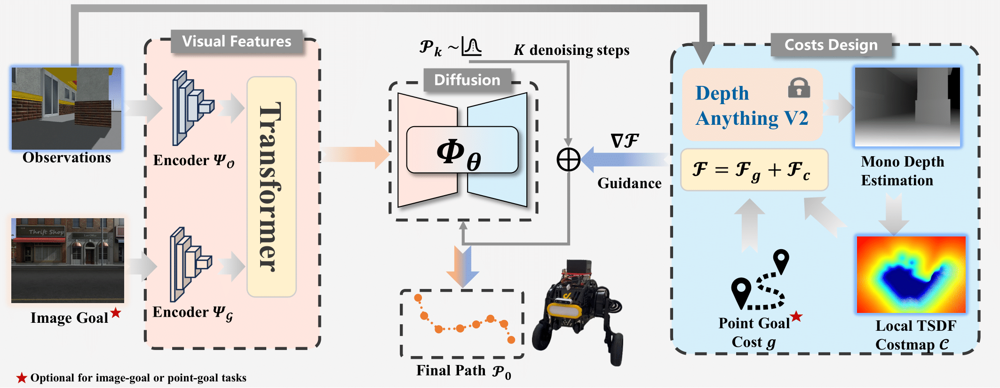

# NaviDiffusor: Cost-Guided Diffusion Model for Visual Navigation

> 🏆 Accepted at **ICRA 2025**  
> 🔗 [arXiv](https://arxiv.org/abs/2504.10003) | [Bilibili](https://www.bilibili.com/video/BV1PaLizwEkW/) | [Youtube](https://www.youtube.com/watch?v=94ODPEqyP0s)

<p align="center">
  
</p>

---

## ✅ TODO List

- [ ] Training code updates
- [ ] Simulation Envs

## ⚙️ Setup
Run the commands below inside the project directory:
1. Set up the conda environment:
    ```bash
    conda env create -f train/train_environment.yml
    ```
2. Source the conda environment:
    ```
    conda activate navidiffusor
    ```
3. Install the vint_train packages:
    ```bash
    pip install -e train/
    ```
4. Install the `diffusion_policy` package from this [repo](https://github.com/real-stanford/diffusion_policy):
    ```bash
    git clone git@github.com:real-stanford/diffusion_policy.git
    pip install -e diffusion_policy/
    ```
5. Install the `depth_anything_v2` package from this [repo](https://github.com/DepthAnything/Depth-Anything-V2):
    ```bash
    git clone https://github.com/DepthAnything/Depth-Anything-V2.git
    pip install -e Depth-Anything-V2/
    ```

## Data
- [RECON](https://sites.google.com/view/recon-robot/dataset)
- [SCAND](https://www.cs.utexas.edu/~xiao/SCAND/SCAND.html#Links)
- [GoStanford2 (Modified)](https://drive.google.com/drive/folders/1xrNvMl5q92oWed99noOt_UhqQnceJYV0?usp=share_link)
- [SACSoN/HuRoN](https://sites.google.com/view/sacson-review/huron-dataset)

We recommend you to download these (and any other datasets you may want to train on) and run the processing steps below.

### Data Processing 

We provide some sample scripts to process these datasets, either directly from a rosbag or from a custom format like HDF5s:
1. Run `process_bags.py` with the relevant args, or `process_recon.py` for processing RECON HDF5s. You can also manually add your own dataset by following our structure below.
2. Run `data_split.py` on your dataset folder with the relevant args.
3. Expected structure:

```
├── <dataset_name>
│   ├── <name_of_traj1>
│   │   ├── 0.jpg
│   │   ├── 1.jpg
│   │   ├── ...
│   │   ├── T_1.jpg
│   │   └── traj_data.pkl
│   ├── <name_of_traj2>
│   │   ├── 0.jpg
│   │   ├── 1.jpg
│   │   ├── ...
│   │   ├── T_2.jpg
│   │   └── traj_data.pkl
│   ...
└── └── <name_of_trajN>
    	├── 0.jpg
    	├── 1.jpg
    	├── ...
        ├── T_N.jpg
        └── traj_data.pkl
```  

Each `*.jpg` file contains an forward-facing RGB observation from the robot, and they are temporally labeled. The `traj_data.pkl` file is the odometry data for the trajectory. It’s a pickled dictionary with the keys:
- `"position"`: An np.ndarray [T, 2] of the xy-coordinates of the robot at each image observation.
- `"yaw"`: An np.ndarray [T,] of the yaws of the robot at each image observation.


After step 2 of data processing, the processed data-split should the following structure inside `/train/vint_train/data/data_splits/`:

```
├── <dataset_name>
│   ├── train
|   |   └── traj_names.txt
└── └── test
        └── traj_names.txt 
``` 

## Model Training
```bash
cd /train
python train.py -c <path_of_train_config_file>
```
The config yaml files are in the `train/config` directory. 

## Deployment

<!-- ### Collecting a Topological Map


This section discusses a simple way to create a topological map of the target environment for deployment. For simplicity, we will use the robot in “path-following” mode, i.e. given a single trajectory in an environment, the task is to follow the same trajectory to the goal. The environment may have new/dynamic obstacles, lighting variations etc.

#### Record the rosbag: 
```bash
./record_bag.sh <bag_name>
```

Run this command to teleoperate the robot with the joystick and camera. This command opens up three windows 
1. `roslaunch vint_locobot.launch`: This launch file opens the `usb_cam` node for the camera, the joy node for the joystick, and nodes for the robot’s mobile base.
2. `python joy_teleop.py`: This python script starts a node that reads inputs from the joy topic and outputs them on topics that teleoperate the robot’s base.
3. `rosbag record /usb_cam/image_raw -o <bag_name>`: This command isn’t run immediately (you have to click Enter). It will be run in the /deployment/topomaps/bags directory, where we recommend you store your rosbags.

Once you are ready to record the bag, run the `rosbag record` script and teleoperate the robot on the map you want the robot to follow. When you are finished with recording the path, kill the `rosbag record` command, and then kill the tmux session.

#### Make the topological map: 
```bash
./create_topomap.sh <topomap_name> <bag_filename>
```

This command opens up 3 windows:
1. `roscore`
2. `python create_topomap.py —dt 1 —dir <topomap_dir>`: This command creates a directory in `/deployment/topomaps/images` and saves an image as a node in the map every second the bag is played.
3. `rosbag play -r 1.5 <bag_filename>`: This command plays the rosbag at x5 speed, so the python script is actually recording nodes 1.5 seconds apart. The `<bag_filename>` should be the entire bag name with the .bag extension. You can change this value in the `make_topomap.sh` file. The command does not run until you hit Enter, which you should only do once the python script gives its waiting message. Once you play the bag, move to the screen where the python script is running so you can kill it when the rosbag stops playing.

When the bag stops playing, kill the tmux session. -->


### Inference with Guidance
🚀 **Our method is designed to provide guidance for any diffusion-based navigation model while inferece, improving path generation quality for both PointGoal and ImageGoal tasks. Here, we use [NoMaD](https://github.com/robodhruv/visualnav-transformer) as an example, an adaptable implementation in [guide.py](./deployment/src/guide.py) is provided for integrating with your own diffusion model.**

_Make sure to run this script inside the `/deployment/src/` directory._

```bash
./navigate.sh --model <model_name> --dir <topomap_dir> --point-goal False  # set --point-goal=True for PointGoal navigation, False for ImageGoal
```

The `<model_name>` is the name of the model in the `/deployment/config/models.yaml` file. In this file, you specify these parameters of the model for each model (defaults used):
- `config_path` (str): path of the *.yaml file in `/train/config/` used to train the model
- `ckpt_path` (str): path of the *.pth file in `/deployment/model_weights/`


Make sure these configurations match what you used to train the model. The configurations for the models we provided the weights for are provided in yaml file for your reference.

The `<topomap_dir>` is the name of the directory in `/deployment/topomaps/images` that has the images corresponding to the nodes in the topological map. The images are ordered by name from 0 to N.

This command opens up 4 windows:

1. `roslaunch vint_locobot.launch`: This launch file opens the usb_cam node for the camera, the joy node for the joystick, and several nodes for the robot’s mobile base.
2. `python navigate.py --model <model_name> --dir <topomap_dir>`: This python script starts a node that reads in image observations from the `/usb_cam/image_raw` topic, inputs the observations and the map into the model, and publishes actions to the `/waypoint` topic.
3. `python joy_teleop.py`: This python script starts a node that reads inputs from the joy topic and outputs them on topics that teleoperate the robot’s base.
4. `python pd_controller.py`: This python script starts a node that reads messages from the `/waypoint` topic (waypoints from the model) and outputs velocities to navigate the robot’s base.

When the robot is finishing navigating, kill the `pd_controller.py` script, and then kill the tmux session. If you want to take control of the robot while it is navigating, the `joy_teleop.py` script allows you to do so with the joystick.

## Citing
```
  @article{zeng2025navidiffusor,
  title={NaviDiffusor: Cost-Guided Diffusion Model for Visual Navigation},
  author={Zeng, Yiming and Ren, Hao and Wang, Shuhang and Huang, Junlong and Cheng, Hui},
  journal={arXiv preprint arXiv:2504.10003},
  year={2025}
}
```
## Acknowlegdment
NaviDiffusor is inspired by the contributions of the following works to the open-source community:[NoMaD](https://github.com/robodhruv/visualnav-transformer), [Depthanythingv2](https://github.com/DepthAnything/Depth-Anything-V2) and [ViPlanner](https://github.com/leggedrobotics/viplanner). We thank the authors for sharing their outstanding work.