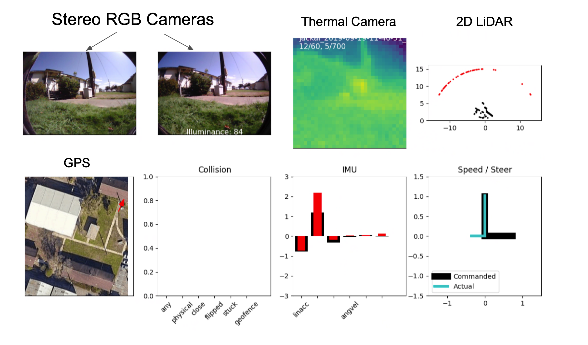

# Rapid Exploration for Open-World Navigation with Latent Goal Models 
## Anonymous Authors

<br>
This package provides helper scripts to visualize the offline trajectory dataset accompanying the paper.
<br>




We curate a dataset of over 5000 self-supervised trajectories collected over 9 distinct real-world environments. These trajectories capture the interaction of the robot in diverse environments, including phenomena like collisions with obstacles and walls, getting stuck in the mud or pits, or flipping due to bumpy terrain. The dataset contains measurements from a wide range of sensors including a pair of stereo RGB cameras, thermal camera, 2D LiDAR, GPS and IMU to support offline evaluation using an alternative suite of sensors. While a lot of these sensor measurements can be noisy and unreliable, we believe that learning-based techniques coupled with multimodal sensor fusion can provide a lot of benefits in the real-world. This dataset was collected over a span of 18 months and exhibits significant variation in appearance due to seasonal and lighting changes.

<br>

## Setup Instructions

Open a terminal inside this folder.

```
conda create -n recon python=3.6
conda activate recon
```

Next, we will install the dependencies and the visualization package.

```
pip install -r requirements.txt
pip install -e .
```

<br>

We are now ready to visualize the dataset. Download and unzip the dataset to a location on your computer, and voila!

```
python visualize.py -folders <path-to-folder>
```